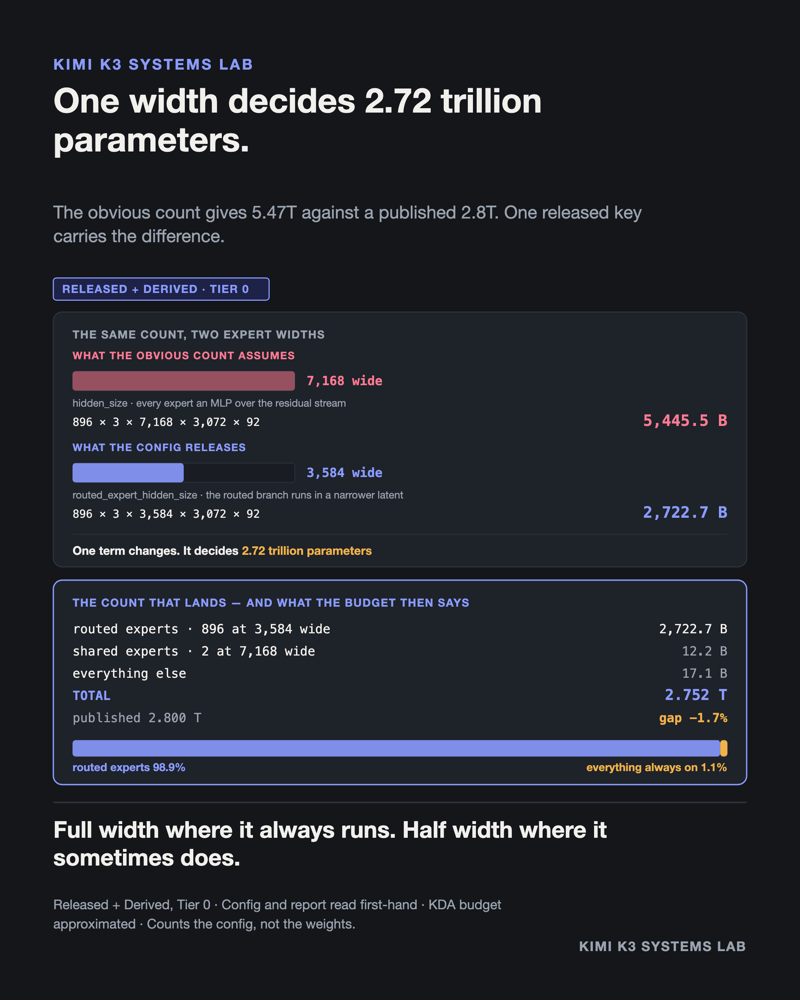

# A config is a blueprint, not an inventory

**Evidence class:** Released + Derived · **Cost tier:** 0 (arithmetic) · **Provenance:** my own derivation

## The claim

Counting Kimi K3's parameters the obvious way — every expert an MLP over the 7,168-wide residual
stream — gives 5.47 trillion against a published 2.8 trillion. Nearly double. The multiplication is
correct. The architecture it describes is not the one that was built.



```
$ python3 count_the_config.py

  STEP 1 - COUNT IT THE OBVIOUS WAY
    experts                5457.64 B
    TOTAL                     5.47 T     published: 2.8 T
    Off by +95.5%.

  STEP 2 - THE KEY I HAD NOT NOTICED
    routed_expert_hidden_size: 3584

  STEP 3 - COUNT IT AGAIN
    routed experts (3,584 wide)      2722.74 B
    shared experts (7,168 wide)        12.16 B
    TOTAL                              2.752 T
    published                          2.800 T
    gap                                 -1.7 %
```

## What the script shows

1. **The naive count is exact arithmetic for a different model.** 898 experts, three matrices each
   at 7,168 × 3,072, across 92 MoE layers, is 5,457.6 B before anything else is counted. Nothing in
   that sum is wrong except the width.
2. **One released key carries the difference.** `hidden_size` is 7,168 and
   `routed_expert_hidden_size` is 3,584. Moonshot's technical report specifies the mapping: the
   routed branch projects the full-width input into a narrower latent, dispatches that to the
   selected routed experts, then projects the aggregate back. The two shared experts stay full width.
3. **The corrected count lands at −1.7% of published**, from public values and arithmetic alone.
   The published total is used as an audit invariant — something to miss against — not as an input
   to tune toward.
4. **A count that lands is also a budget, and this one is lopsided.** Routed experts are 2,722.7 B,
   **98.9%** of the corrected total; everything always on — both shared experts plus attention, the
   dense MLP, the routers and the embeddings — is 29.2 B, the other 1.1%. And the two paths are not
   built at the same width. The always-on path runs at the full 7,168. The routed path runs at
   3,584, and only 16 of its 896 experts fire for any given token. Full width where it always runs,
   half width where it sometimes does. That is a description of the budget, not of anyone's
   reasoning: the config states no rationale, and intent is not recoverable from arithmetic.

## Boundary

This counts the model the config **describes**. It is not a tensor inventory of the released
checkpoint; no shard was opened. Where the two disagree, the checkpoint wins.

Every input is labelled RELEASED in the script except one: the KDA attention projection budget is
an explicit approximation rather than a tensor inventory. The remaining −1.7% could come from that
approximation or from components this short count does not model. It is not explained here, and it
is not explained by the 104B activated-parameter figure either — the active count is a separate
accounting problem and is deliberately not used to close this gap.

Nothing here establishes why the authors chose the design.

## Sources

Both read first-hand:

- `config.json` — https://huggingface.co/moonshotai/Kimi-K3/blob/main/config.json
- Kimi K3 technical report, §2.3 — https://github.com/MoonshotAI/Kimi-K3/blob/main/k3_tech_report.pdf

## Run it

```bash
python3 count_the_config.py
```

Standard library only. The script asserts its own headline figures, so a transcription error fails
loudly rather than quietly shipping.
