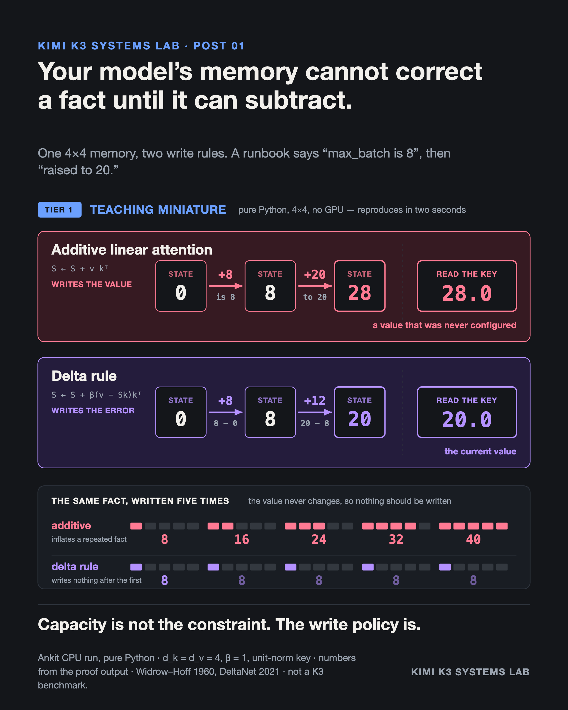

# Delta Rule Correction — A Memory That Can Subtract

**Evidence class:** Teaching miniature · **Cost tier:** 1 (CPU) · **Provenance:** my own run

## The claim

An additive linear-attention memory cannot correct a fact. Write a new value under a key it has
already seen and it answers with the *sum* of the old and new values. The delta rule writes the
**error** instead of the value, and answers with the current value.



```
$ python3 delta_rule_correction.py

  additive linear attention answered  28.0    <- 8 + 20, a number never configured
  delta rule answered                 20.0    <- the current value
```

Both memories are the same size: 4 × 4 numbers. The difference is not capacity. It is the write
policy.

## What the script shows

1. **A setting is corrected.** "max_batch is 8", then "max_batch was raised to 20." Additive
   answers 28.0; the delta rule answers 20.0, having written only the error, 20 − 8 = 12.
2. **A fact is merely repeated.** Five identical writes. Additive returns 8, 16, 24, 32, 40 — it
   inflates a fact for being repeated. The delta rule's error is zero after the first write, so it
   writes nothing.
3. **β is a write strength, not a switch.** A sweep from 0 to 1. In the gated delta-rule family, β
   is produced per token by a learned projection through a sigmoid, so the model chooses how hard
   to overwrite. Exact replacement at β = 1 depends on the key being unit-norm.

## Boundary

This is a 4 × 4 single-head miniature with hand-chosen unit-norm keys and no trained weights. It
demonstrates a **write-policy property of two update rules.** It establishes nothing about Kimi
K3's accuracy, throughput, latency, or quality.

It is also not KDA. This is the update rule alone — no decay gate, no short convolution, no
chunkwise form, no learned projections. Those are separate mechanisms.

## Prior art

The delta rule is Widrow and Hoff (1960). Its use as a linear-attention update is DeltaNet
(Schlag, Irie & Schmidhuber, 2021); the gated form is Gated DeltaNet (Yang et al., 2024). The
pure-Python reproduction, the repetition ladder, and the β sweep are mine.

## Run it

```bash
python3 delta_rule_correction.py
```

Standard library only. About two seconds.
