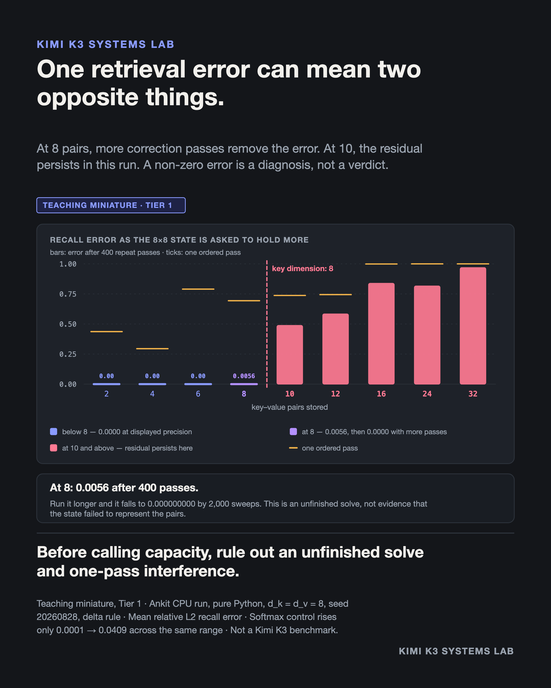

# A retrieval error does not tell you which failure it is

**Evidence class:** Teaching miniature · **Cost tier:** 1 (CPU) · **Provenance:** my own run

## The claim

When a fixed-size associative memory returns the wrong value, at least three different things
produce that same symptom: the iterative solve has not finished, the information genuinely no
longer fits, or new writes are damaging old ones. The error column cannot tell them apart. A
second experiment can.



```
$ python3 retrieval_cliff.py

   pairs |   one pass | repeat 400 |   softmax
  -------+------------+------------+----------
       4 |     0.2950 |     0.0000 |    0.0000
       8 |     0.6938 |     0.0056 |    0.0002   <-- state is full
      10 |     0.7373 |     0.4885 |    0.0016

    sweeps |           n = 8 |          n = 10
  ---------+-----------------+----------------
       400 |     0.005644058 |     0.488540448
      2000 |     0.000000000 |     0.488540448
     20000 |     0.000000000 |     0.488540448
```

The state is 8 × 8 — 64 numbers, and it never grows. Both columns above use the same state and the
same draws. What changes is the update budget.

## What the script shows

1. **Two errors that look alike are not alike.** At 400 correction passes, n = 8 has a residual of
   0.0056 and n = 10 has 0.4885. Running 50× longer sends the first to zero at nine decimal places
   and leaves the second unchanged. The n = 8 residual was an unfinished solve; at full rank the
   key matrix is ill-conditioned, so the iteration converges slowly rather than incompletely.
2. **One ordered pass fails long before capacity does.** At 4 pairs — half capacity — the one-pass
   error is already 0.2950. Each write is a rank-1 correction aimed at one key, and random keys are
   not orthogonal, so every write disturbs the neighbours that share direction with it. That is
   interference, not capacity: the same 4 pairs are recalled exactly once the solve is allowed to
   run.
3. **Softmax is the control, not the winner.** Its error rises too, from 0.0001 to 0.0409 across a
   32× increase in pairs — a gentle slope, and about 12× below the linear state's first large
   residual. It degrades because a fixed temperature blurs nearby keys, not because it ran out of
   room: it kept every key. Keeping every key is exactly the cost priced in
   [million-token-attention](../million-token-attention/) and
   [flashattention-boundary](../flashattention-boundary/).

## Boundary

This is a d_k = d_v = 8 single-head miniature on random unit-norm keys, with no trained weights.
It establishes nothing about Kimi K3's recall, accuracy, or long-context quality, and it is not a
benchmark of any released model.

The sampled sizes are 2, 4, 6, 8, 10, 12, 16, 24, 32, 64, so n = 9 is never tested, and each size
is a single seeded draw. What is measured is a large jump between 8 and 10 for these draws, not the
absence of every intermediate value.

The persistent n = 10 residual is an **observation across the sweep budget that was run**, not a
proven lower bound. Establishing a genuine floor needs a rank or residual argument, not a longer
run. For generic independent associations, a state with d key dimensions cannot guarantee exact
interpolation once more than d constraints arrive; this run illustrates that structural limit
rather than proving it.

Kimi K3's released configuration pairs 69 KDA layers with 24 full-attention layers. This miniature
says nothing about why.

## Prior art

The delta rule is Widrow and Hoff (1960). Its use as a linear-attention update is DeltaNet
(Schlag, Irie & Schmidhuber, 2021). The pure-Python reproduction, the capacity sweep, the
sweep-depth test, and the softmax control are mine.

The write policy itself is the subject of [delta-rule-correction](../delta-rule-correction/); this
experiment holds the policy fixed and varies how much is asked of it.

## Run it

```bash
python3 retrieval_cliff.py
```

Standard library only. About three seconds, most of it in the sweep-depth section.
